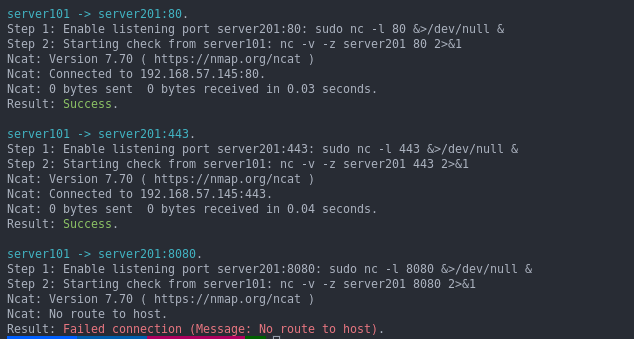

## Port Checker 

A simple script to verify the required ports are opened between nodes before the deployment of multi-component/multi-node software stacks.

The script will parse the simple CSV file and read the source, destination and firewall port entries.

- Multiple entries can be tested (see sample).
- Script will start port listening on target machine (`sudo nc -l $entry_port &>/dev/null &`)
- Script will check the target and port from source machine (`nc -v -z $entry_destination $entry_port 2>&1`)


## Sample CSV

The source file (eg: `port-checker-data.csv`) is formatted as follows and without any header.

```csv
Source,Destination,Port
```
Example CSV file without header.

```csv
$ cat port-checker-data.csv
localhost,192.168.57.145,80
192.168.57.140,192.168.57.145,443

```

Note: Remember to add a new line at the end of file.

## Prerequisite

- Nodes (source and destination) are able to access from the localhost over SSH without password.
- The `remote_user` has sudo access on target nodes without password.
- The `nc` utility is available on both source and destination nodes.

## Run `port-checker.sh` script

There is no parameter to pass as the source filename `port-checker-data.csv` (list of entries to check) is hardcoded inside the script.

```shell
$  ./port-checker.sh 

========= server101 -> server201:80 =========
Enable listening port server201:80
Starting check from server101 on 80: nc -v -z server201 80 2>&1
Ncat: Version 7.70 ( https://nmap.org/ncat )
Ncat: Connected to 192.168.57.145:80.
Ncat: 0 bytes sent, 0 bytes received in 0.02 seconds.
finished

========= server101 -> server201:443 =========
Enable listening port server201:443
Starting check from server101 on 443: nc -v -z server201 443 2>&1
Ncat: Version 7.70 ( https://nmap.org/ncat )
Ncat: Connected to 192.168.57.145:443.
Ncat: 0 bytes sent, 0 bytes received in 0.02 seconds.
finished

========= server101 -> server201:8080 =========
Enable listening port server201:8080
Starting check from server101 on 8080: nc -v -z server201 8080 2>&1
Ncat: Version 7.70 ( https://nmap.org/ncat )
Ncat: No route to host.
finished
```

From the above output,

- `server101 -> server201:80` - is successful
- `server101 -> server201:443` - is successful
- `server101 -> server201:8080` - is failed; either `8080` is not open or firewall is blocking the port.

Sample output color on result.

